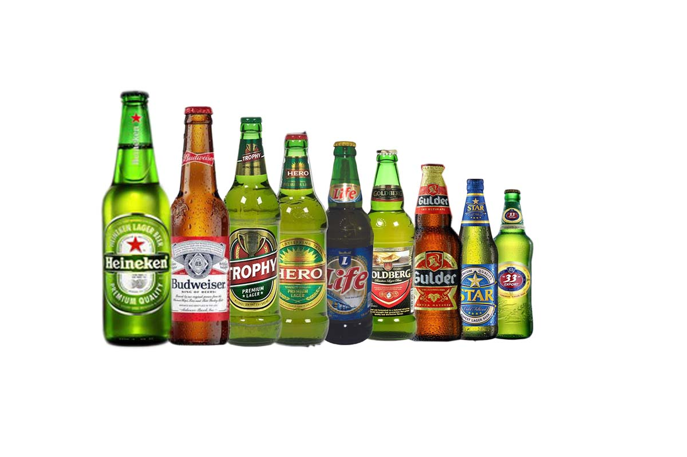
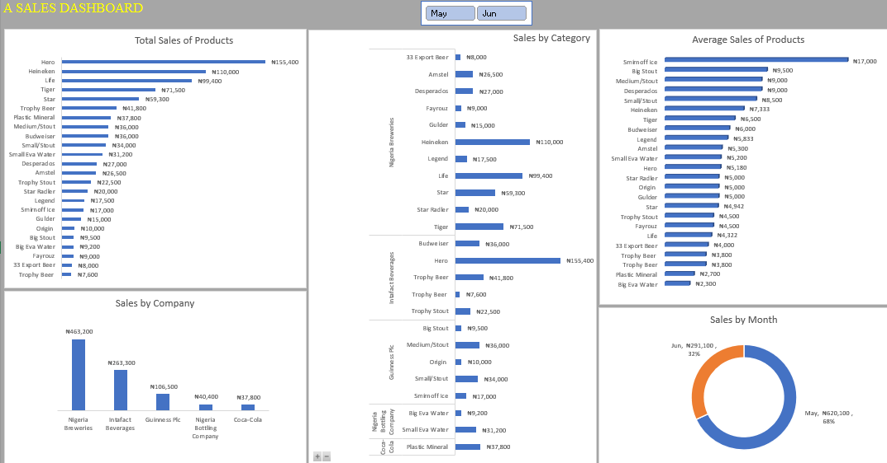
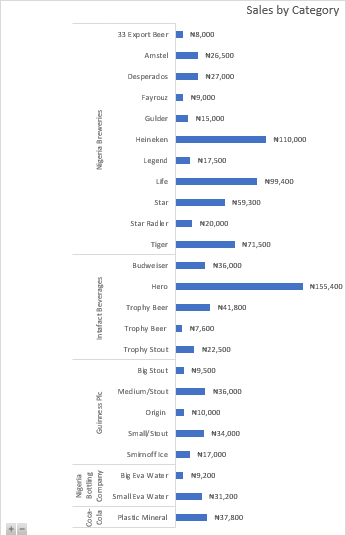
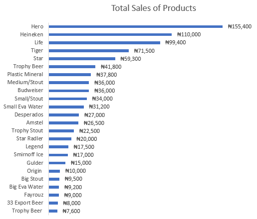
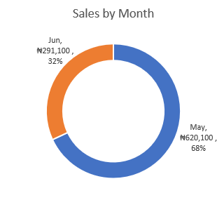
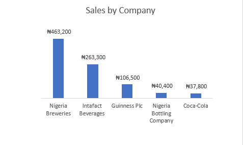
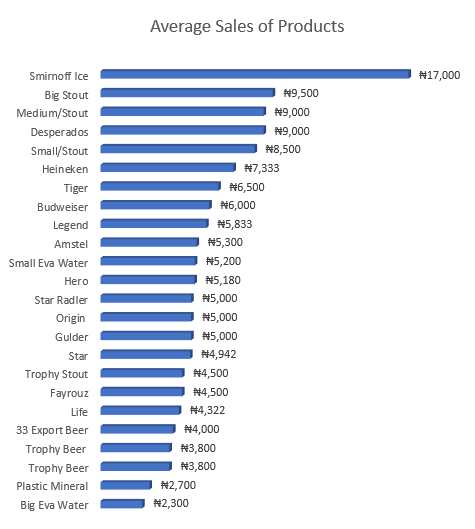

# Retailer-Purchases-of-Beverages-From-a-Wholesaler-

---

## Introduction
This is an Excel project on sales analysis on Beverages supplied by a wholesaler to a retailer. The project is to analyze and derive insights to answer important questions.  

## Problem Statement 
1.  For us to know which product is performing well in each category
2.  To determine which product has more sales	
3.  To see sales by month performance 
4.	To determine how much each company had made on sales.
5.  To determine the Average sales of products

## Skills Demonstrated
The skills I incorporated in the course of the project includes:
1.	Data entry skills
2.	Using Pivot table for Analysis
3.	Using of slicers

## Data Sourcing
I personally sourced for the data used for this project. It was in an invoice sheet which contains purchases made by the retailer from the wholesaler from May – June 2023.

## Data Transformation 
Using Excel, I was able to enter in the data from the invoice sheet by creating columns with important headers and rows to match the columns. Data cleaning was also done with excel were;
-	Wrong spellings were removed
-	Duplicate entries were checked

## Data Modeling
No modeling was required since we just used a table for analysis.

## Analysis and Visualizations 

This is the dasboard for the Analysis.

## Sales by Category

From the category which was sorted from Largest to Smallest, we can see the company and their products. Nigeria Breweies had 11 different product under it. Coca-Cola was least in the category with Plastic mineral as it only product. There is a slicer button of May and June to determine sales by month in each category.

## Total Sales of Product

Hero had more sales when compared with other product. while Trophy Beer had low sales. From here we can see that plastic minerals which is the only product of Coca-Cola had more sales compared to other category products.

## Sales by Month

The month of May had more sales when compared to the month of  June. 
## Sale by Company

Nigeria Breweies top the chart with a greater number of sales. Coca-Cola had the least sales as a company.

## Average Sales of product

The Average sales of product shows that Smirnoff ice had high average sales and Big Eva water had low average sales.

## Conclusion and Recommendation 

•	Heineken, Hero, Medium/Stout, Small Eva water and Plastic mineral respectively were product which toped their different categories.
•	Hero came top the chart with the highest total sale. 
•	The month of May had more sales than June. 
•	Nigeria Breweries as a company made a higher sale than the other companies combined together. 
•	Sminorff Ice had high Average sales.

Recommendation: The consumers has a role in this as their preference of a particular product over another affects the quantity purchase thereby reducing supply which might affect the company sales. 
---

For following through. 😄 

 
